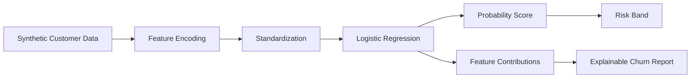

# ChurnGuard DS


`ChurnGuard DS` is a portfolio-ready Data Science project for predicting customer churn and explaining retention risk.
It is built to look credible in interviews: the codebase includes synthetic-but-realistic telecom customer data, a logistic regression model implemented from scratch, evaluation metrics, risk segmentation, and explanation of the most important churn drivers.

## Recruiter Snapshot

- Business problem: identify customers at high risk of churn before cancellation happens
- What I built: an end-to-end supervised learning pipeline with custom logistic regression, evaluation, and local explanation
- Technical signal: feature engineering, scaling, one-hot encoding, metrics, CLI tooling, deterministic data generation, tests
- Evidence: `Accuracy = 0.95`, `F1 = 0.833`, `ROC AUC = 0.992` on the sample evaluation split

## Results Snapshot

| Area | Evidence |
|---|---|
| Predictive quality | `Accuracy = 0.95`, `Precision = 0.909`, `Recall = 0.769`, `F1 = 0.833`, `ROC AUC = 0.992` |
| Explainability | per-customer churn probability, risk band, top risk drivers, top retention drivers |
| Engineering quality | reproducible data generation, package structure, CLI commands, CSV export, automated tests |
| Business framing | retention prioritization for telecom, SaaS, subscription, and banking use cases |

## Tech Stack

- Python 3.10
- Logistic regression implemented from scratch
- Feature scaling and one-hot encoding
- Evaluation metrics: accuracy, precision, recall, F1, ROC AUC
- CLI tooling with `argparse`
- CSV export for downstream BI and analytics workflows

## Skills Demonstrated

- End-to-end supervised learning pipeline design
- Customer churn modeling for a business retention use case
- Model evaluation and threshold-based decision framing
- Prediction explainability through feature contribution analysis
- Clean packaging and testable project structure

## Business Problem

Subscription businesses lose revenue when customers silently disengage and cancel.
Retention teams need a practical scoring system to:

- identify high-risk customers early
- understand which behaviors increase churn risk
- prioritize outreach, incentives, and account management

This project focuses on an interpretable baseline model instead of a heavyweight black-box system.

## Features

- Generate a reproducible telecom churn dataset
- Train logistic regression from scratch using gradient descent
- Evaluate with accuracy, precision, recall, F1, ROC AUC, and confusion matrix
- Score individual customers with churn probability and risk band
- Explain predictions using top positive and negative feature contributions
- Export the synthetic dataset to CSV for analysis in Excel, Power BI, or notebooks

## Architecture



## Project Structure

```text
.
|-- churnguard_ds/
|   |-- cli.py
|   |-- dataset.py
|   |-- metrics.py
|   |-- model.py
|   |-- pipeline.py
|   `-- preprocessing.py
|-- churnguard_examples/
|   `-- customer.json
|-- churnguard_data/
|   `-- README.md
`-- tests/
    `-- test_churnguard.py
```

## Quick Start

Run the end-to-end demo:

```bash
python -m churnguard_ds.cli demo
```

Evaluate the model:

```bash
python -m churnguard_ds.cli evaluate
```

Predict churn risk for a sample customer:

```bash
python -m churnguard_ds.cli predict --json-file churnguard_examples/customer.json
```

Export the dataset to CSV:

```bash
python -m churnguard_ds.cli export-data --output churnguard_data/synthetic_customers.csv
```

Run tests:

```bash
python -m unittest tests.test_churnguard -v
```

## Example Output

```text
ChurnGuard DS
Model: Logistic Regression (from scratch)

Accuracy : 0.95
Precision: 0.909
Recall   : 0.769
F1 Score : 0.833
ROC AUC  : 0.992
```

## Interview Talking Points

- Why logistic regression is still a strong baseline for churn prediction when interpretability matters
- How feature scaling and one-hot encoding support a reproducible classical ML workflow
- Why ROC AUC, precision, recall, and F1 all matter more than accuracy alone in churn problems
- How this repo could be extended into a dashboard, notebook analysis, or model comparison study

## Why This Is Strong For CV

- Solves a classic business problem used in telecom, SaaS, banking, and subscription products
- Shows understanding of supervised learning, preprocessing, evaluation, and explainability
- Uses a fully reproducible pipeline instead of a notebook-only prototype
- Easy to extend into a dashboard, notebook analysis, or REST API

## Recruiter Notes

- Business use case: customer retention and churn-risk prioritization
- Core capability: predict churn probability and explain the main drivers
- Engineering signal: custom model implementation, metrics, CLI, deterministic data generation, tests
- Extension path: dashboarding, model comparison, calibration, monitoring

## Suggested Next Upgrades

- Add SHAP-like local explanations and calibration plots
- Compare logistic regression with decision trees or gradient boosting
- Build a Streamlit retention dashboard
- Add cohort analysis and churn trend monitoring

## CV Copy

Ready-to-paste bullets are available in [docs/CHURN_CV_BULLETS.md](docs/CHURN_CV_BULLETS.md).

## License

This project is released under the [MIT License](LICENSE).
